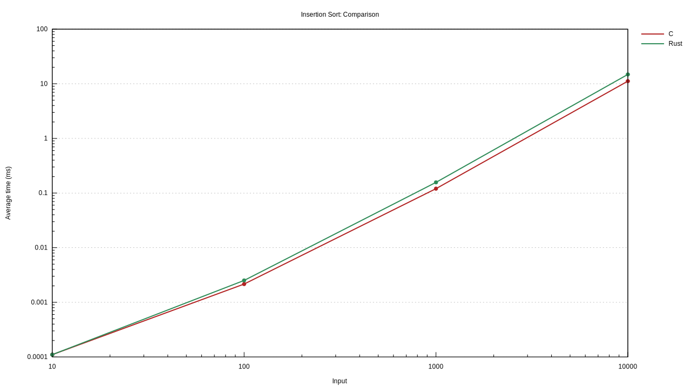
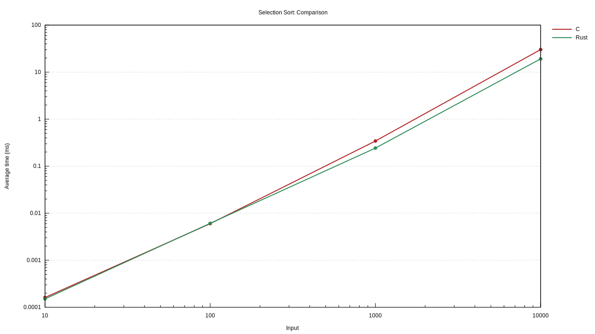

# About

This project aims to benchmark different sort algorithms implemented in C and in Rust. Instead of just using the fastest algorithms we also want to test the performance of less complex algorithms that are taught in many CS classes. We hope this will make it easier to understand why algorithms with the same theoretical complexity perform very differently on a real computer.

# Build

1. Install Rust. We recommend the [rustup](https://rustup.rs) installer.
2. Install a C compiler such as GCC or clang (the compiler choice will influence the results).
3. Run `cargo bench`
4. Plots can be found at `target/criterion/report/index.html`

# Results

> Tested on a Core i5-8250U

